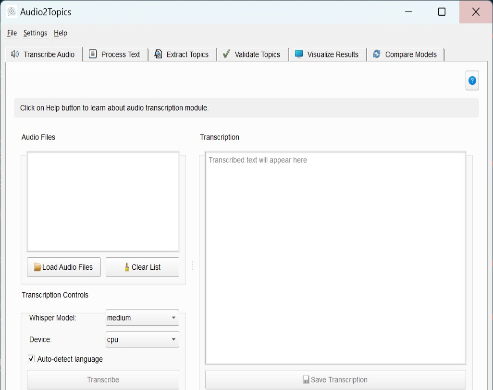

# Overview

# `Audio2Topics` Package 🔊🗂️

`Audio2Topics` is python packge that automizes topic extraction from voice files. The package is originally designed to aid researchers that performs interview research. Interview research typically incorporates a series of steps, starting from planning research questions, performing interviews, transcribing, and thorough manual text analysis to extract the main themes and topics of the transcribed text. This manual analysis phase is usually long and time-consuming. Additionally, the feasibility of manual analysis is limited by the volume of transcribed data.  `Audio2Topics` accelerating this step by automtically converting voice files of interviews into topics simply and effectively.

Coming soon!
