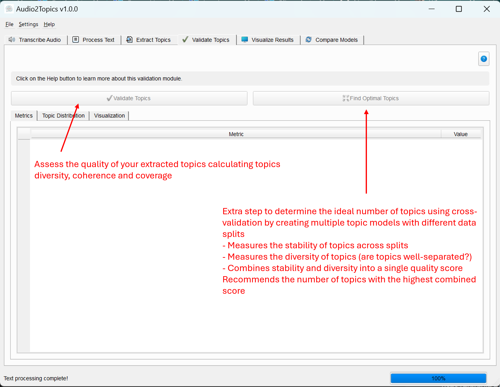

# Topic Validation Module

## Overview

The Topic Validation module enables you to evaluate the quality of extracted topics and determine the optimal number of topics for your document collection. It provides quantitative metrics to assess whether your topic model is effectively capturing the underlying themes in your text data.

This module allows you to:
- Measure the quality of extracted topics using multiple metrics
- Find the optimal number of topics for your document collection
- Visualize topic distribution and quality metrics
- Make data-driven decisions to improve your topic model

Unlike the extraction process which focuses on finding topics, validation helps you assess if those topics are good, coherent, and representative of your content.


*Main interface of the Validator Tab showing metrics and distribution*

## Core Components

### TopicValidator Class

The `TopicValidator` class serves as the main interface for validation functionality. It manages the validation and optimization processes.

#### Methods

| Method | Description | Parameters | Returns |
|--------|-------------|------------|---------|
| `validate_model()` | Starts validation of a topic model | `documents`: List of document strings<br>`topic_model`: Trained topic model | Returns the worker thread that can be connected to signals |
| `find_optimal_topics()` | Starts optimization to find the optimal number of topics | `documents`: List of document strings<br>`max_topics`: Maximum number of topics to consider<br>`min_topic_size`: Minimum topic size<br>`**bertopic_kwargs`: Additional arguments | Returns the worker thread that can be connected to signals |

### ValidationWorker Class

The `ValidationWorker` class extends `QThread` to handle topic validation in a background thread, keeping the UI responsive during processing.

#### Signals

| Signal | Description | Parameters |
|--------|-------------|------------|
| `progress_updated` | Emitted to update progress | `int`: progress percentage, `str`: status message |
| `validation_completed` | Emitted when validation is done | `dict`: metrics dictionary, `object`: summary DataFrame |
| `error_occurred` | Emitted when an error occurs | `str`: error message |

### OptimizationWorker Class

The `OptimizationWorker` class extends `QThread` to handle finding the optimal number of topics in a background thread.

#### Signals

| Signal | Description | Parameters |
|--------|-------------|------------|
| `progress_updated` | Emitted to update progress | `int`: progress percentage, `str`: status message |
| `optimization_completed` | Emitted when optimization is done | `dict`: recommendations dictionary |
| `error_occurred` | Emitted when an error occurs | `str`: error message |

## Validation Metrics

The module calculates several key metrics to evaluate topic quality:

### Topic Diversity (0-1)

Measures how distinct topics are from each other based on the uniqueness of words across topics.

- **High diversity (>0.7)**: Topics have minimal overlap in keywords, indicating well-separated themes
- **Low diversity (<0.3)**: Topics share many keywords, suggesting redundancy or poorly defined topics

### Topic Coherence (0-1)

Measures how semantically related the words within each topic are.

- **High coherence (>0.7)**: Words in topics are strongly related, forming coherent themes
- **Low coherence (<0.3)**: Words in topics appear random or unrelated

### Topic Coverage (0-1)

The percentage of documents assigned to non-outlier topics (not Topic -1).

- **High coverage (>0.8)**: Most documents fit into meaningful topics
- **Low coverage (<0.5)**: Many documents don't fit into any clear topic

### Other Metrics

- **Number of Topics**: The total number of distinct topics (excluding the outlier topic)
- **Outliers**: Number of documents assigned to Topic -1 (the outlier topic)
- **Topic Distribution**: Count of documents assigned to each topic

## User Interface

The `ValidatorTab` class provides a comprehensive interface for validating topics and finding the optimal topic count.

### UI Components

- **Control Buttons**:
  - "Validate Topics" button to analyze the current topic model
  - "Find Optimal Topics" button to determine the ideal number of topics
  
- **Results Tabs**:
  - **Metrics**: Table showing validation metrics with color coding
  - **Topic Distribution**: Table showing how documents are distributed across topics
  - **Visualization**: Interactive visualization of topic distribution
  
- **Optimization Dialog**:
  - Settings for maximum topics to test
  - Minimum topic size control
  - Progress tracking during optimization
  - Results visualization showing quality scores across different topic counts


## Usage Guide

### Validating a Topic Model

1. Extract topics using the Topic Tab
2. Navigate to the Validator Tab
3. Click "Validate Topics" to begin the validation process
4. Review the metrics in the Results tab
5. Examine the topic distribution to see how documents are assigned
6. Use the visualization to get a graphical view of the topic distribution

```python
# Code example for validating topics programmatically
from core.validator import TopicValidator

validator = TopicValidator()
worker = validator.validate_model(documents, topic_model)

# Connect to signals
worker.progress_updated.connect(update_progress)
worker.validation_completed.connect(handle_results)
worker.error_occurred.connect(handle_error)
```

### Finding the Optimal Number of Topics

1. Navigate to the Validator Tab
2. Click "Find Optimal Topics" to open the optimization dialog
3. Set the maximum number of topics to test (default: 15)
4. Set the minimum topic size (default: 2)
5. Click "Start Optimization" to begin the process
6. Review the results, which include:
   - Recommended number of topics
   - Combined quality score
   - Stability score
   - Diversity score
7. Use the visualization to see how scores vary across different topic counts

```python
# Code example for finding optimal topics programmatically
from core.validator import TopicValidator

validator = TopicValidator()
worker = validator.find_optimal_topics(
    documents, 
    max_topics=15, 
    min_topic_size=2
)

# Connect to signals
worker.progress_updated.connect(update_progress)
worker.optimization_completed.connect(handle_recommendations)
worker.error_occurred.connect(handle_error)
```

## Understanding Optimization

The topic optimization process uses a sophisticated approach to find the ideal number of topics:

1. **Cross-Validation**: For each potential topic count, it performs cross-validation by creating multiple topic models with different data splits
2. **Stability Measurement**: It measures how consistently similar topics emerge across different data splits
3. **Diversity Assessment**: It evaluates how distinct the topics are from each other
4. **Combined Scoring**: It combines stability (weighted 70%) and diversity (weighted 30%) into a single quality score
5. **Recommendation**: It recommends the number of topics with the highest combined score

This approach balances the ability to consistently find the same topics (stability) with the need for topics to be distinct from each other (diversity).

### Optimization Parameters

- **Maximum Topics to Test**: The upper limit for how many topics to consider
- **Minimum Topic Size**: The minimum number of documents required for a topic

## Interpreting Validation Results

### What Makes a Good Topic Model?

A high-quality topic model typically shows:
- High diversity (topics are distinct from each other)
- High coherence (words within topics make sense together)
- High coverage (most documents are assigned to non-outlier topics)
- Balanced distribution of documents across topics

### Common Issues and Solutions

#### Too Many Outliers (Low Coverage)

- **Problem**: Many documents assigned to Topic -1 (outlier topic)
- **Possible solutions**:
  - Decrease the minimum topic size
  - Improve text preprocessing
  - Try a different number of topics (use the optimization feature)
  - Use a different topic modeling method

#### Low Diversity

- **Problem**: Topics share many of the same keywords
- **Possible solutions**:
  - Reduce the number of topics
  - Improve stopword removal
  - Try the BERTopic model instead of LDA or NMF

#### Imbalanced Distribution

- **Problem**: Most documents fall into just a few topics
- **Possible solutions**:
  - Adjust the minimum topic size
  - Increase the number of topics
  - Consider if the imbalance reflects your actual data

## Tips for Effective Validation

### Validation Workflow

1. Run the "Find Optimal Topics" feature first to get a recommended topic count
2. Extract topics using the recommended count in the Topic Tab
3. Validate the resulting topics
4. If validation metrics show issues, adjust parameters and try again
5. Consider refining topics with an LLM for better interpretability

### Balancing Metrics Based on Your Goals

- **For exploratory analysis**: Prioritize diversity and coverage
- **For content summarization**: Prioritize coherence
- **For document classification**: Prioritize balanced topic distribution

### Validation with Small Document Collections

- Use smaller minimum topic sizes (1 or 2)
- Extract fewer topics (3-5 is often sufficient)
- Pay more attention to coherence than diversity
- Be aware that cross-validation results might be less reliable

### Combining with Other Modules

- Use the **Visualizer** to see topic relationships and keyword importance
- Try **Topic Highlighting** to see how topics appear in your actual documents
- Consider **LLM refinement** to improve topic interpretability

## Technical Details

### Stability Calculation

Topic stability is calculated by:
1. Computing topic embeddings or word distributions for topics from different data splits
2. Calculating cosine similarity between topics from different models
3. Finding the maximum similarity for each topic
4. Averaging these maximum similarities to get the overall stability score

### Diversity Calculation

Topic diversity is calculated by:
1. Extracting the top N words from each topic
2. Counting the number of unique words across all topics
3. Dividing by the total number of words (accounting for repetition)
4. This produces a score between 0 and 1, where higher values indicate more diverse topics

### Coherence Calculation

The module uses the coherence score from the BERTopic model, which is based on:
1. How often topic words appear together in the same documents
2. The semantic similarity of words within a topic
3. Higher coherence scores indicate more semantically related words in topics